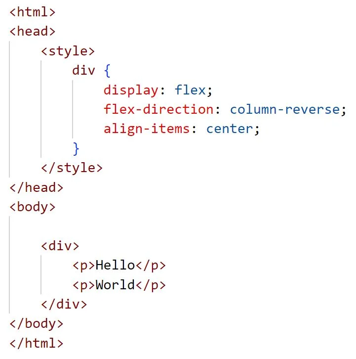
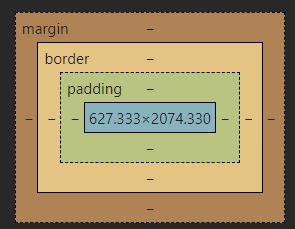
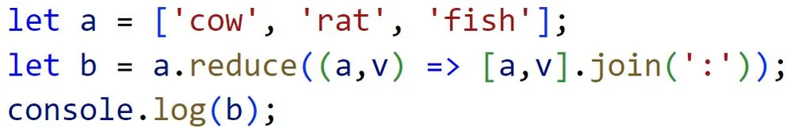

Note: 
Commit this

# Welcome to the Notes

## Website information
### URL
https://galagaonline.click/

### Command to access server command prompt:
`ssh -i ~/OneDrive/Documents/galagakey.pem ubuntu@52.205.246.165`

### IP Address
`52.205.246.165`

## Midterm notes
You can use this CSS to load fonts from Google:
- `@import url('https://fonts.googleapis.com/css2?family=Kode+Mono&display=swap')`

How will the hello world text be oriented?

- Two lines, with the first line saying World and the second saying Hello

Content, Padding, Border, Margin

The following will output 4.

In HTML, `
` creates a division element

The following outputs `['rat', 'fish']`

The following outputs `cow:rat:fish`

The following outputs `['a1', 'a2', 'a3']`

The following code Adds a mouseover event listener to a p element

The html tag for an unordered list is `<ul>`

This is not a valid javascript function: function f(x) = {}

The following are valid ways of including javascript in html
``
`<script src='main.js'>`
`
`

The following are not valid javascript objects
`{ n=1 }`
`{ "n"=1}`
`{ "n"="1" }`

The DOM textcontent property Sets the child text for the an element

The following will not create a valid hyperlink
`<a src='https://c.com'>x</a>`
`<link src='https://c.com'>x</link>`
`<link href='https://c.com'>x</link>`

{"x":3} this is valid json

`chmod +x deploy.sh` makes a script executable

c260.cs.byu.edu is a dns subdomain

use CNAME to point to another DNS record

This will output `burger fries taco shake noodles`

This will output `A D B`
