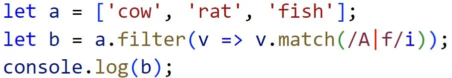
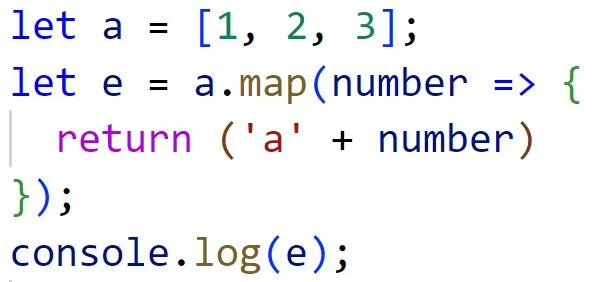
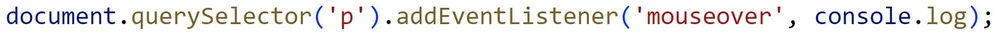
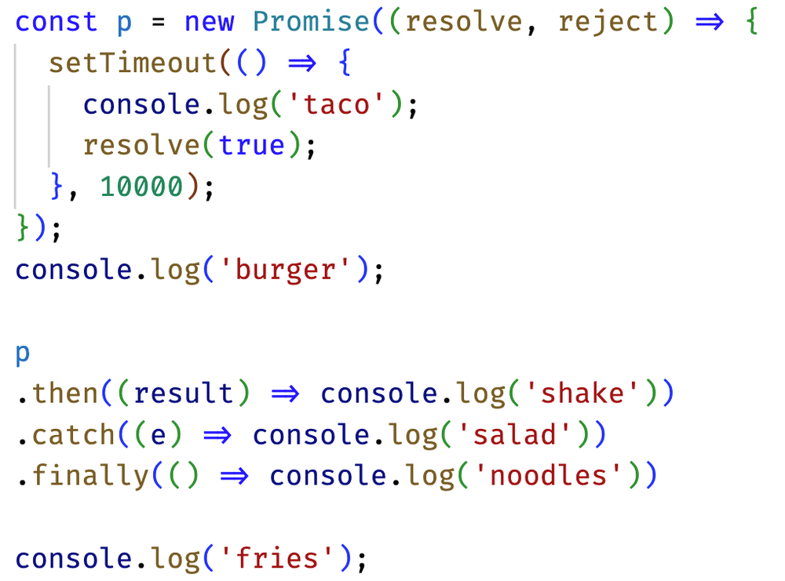

Note: 
Commit this

# Welcome to the Notes

## Website information
### URL
https://galagaonline.click/

### Command to access server command prompt:
`ssh -i ~/OneDrive/Documents/galagakey.pem ubuntu@52.205.246.165`

### IP Address
`52.205.246.165`

## Midterm notes
You can use this CSS to load fonts from Google:
- `@import url('https://fonts.googleapis.com/css2?family=Kode+Mono&display=swap')`

How will the hello world text be oriented?

- Two lines, with the first line saying World and the second saying Hello

Content, Padding, Border, Margin

The following will output 4.

In HTML, `
` creates a division element

The following outputs `['rat', 'fish']`

The following outputs `cow:rat:fish`

The following outputs `['a1', 'a2', 'a3']`

The following code Adds a mouseover event listener to a p element

The html tag for an unordered list is `<ul>`

This is not a valid javascript function: function f(x) = {}

The following are valid ways of including javascript in html
``
`<script src='main.js'>`
`
`

The following are not valid javascript objects
`{ n=1 }`
`{ "n"=1}`
`{ "n"="1" }`

The DOM textcontent property Sets the child text for the an element

The following will not create a valid hyperlink
`<a src='https://c.com'>x</a>`
`<link src='https://c.com'>x</link>`
`<link href='https://c.com'>x</link>`

{"x":3} this is valid json

`chmod +x deploy.sh` makes a script executable

c260.cs.byu.edu is a dns subdomain

use CNAME to point to another DNS record

This will output `burger fries taco shake noodles`

This will output `A D B`

### DOM (Document Object Model):
Traversal and Manipulation:

Methods: getElementById: Finds an element by its ID.
getElementsByClassName: Finds elements by their class name.
getElementsByTagName: Finds elements by their tag name.
querySelector: Finds the first element that matches a CSS selector.
querySelectorAll: Finds all elements that match a CSS selector.
Manipulation:
createElement: Creates a new DOM element.
appendChild: Appends a child node to a parent node.
removeChild: Removes a child node from a parent node.
setAttribute: Sets the value of an attribute on a DOM element.
removeAttribute: Removes an attribute from a DOM element.
classList: Manipulates the classes of a DOM element.
Events:

Types: Click: Triggered when a mouse click occurs.
Mouseover: Triggered when the mouse pointer enters the area of an element.
Keydown: Triggered when a key is pressed down.
Attaching:
addEventListener: Attaches an event handler to a DOM element.
### JavaScript:
Functions:

Syntax: function functionName(parameters) { // code }: Defines a named function with parameters and code block.
Return Statement: return: Specifies the value to be returned from a function.
Arrow Functions: (parameters) => { // code }: A concise way to define functions, especially for inline callbacks.
Arrays and Objects:

Methods: push: Adds one or more elements to the end of an array.
pop: Removes the last element from an array.
shift: Removes the first element from an array.
unshift: Adds one or more elements to the beginning of an array.
splice: Adds or removes elements from an array.
map: Creates a new array with the results of calling a provided function on every element.
filter: Creates a new array with elements that pass a test.
reduce: Applies a function against an accumulator and each element in the array.
Object Properties:
Dot notation (object.property): Accesses a property of an object using dot notation.
Bracket notation (object['property']): Accesses a property of an object using bracket notation.
JSON:

Parsing: JSON.parse: Parses a JSON string and returns a JavaScript object.
Stringifying: JSON.stringify: Converts a JavaScript object into a JSON string.
### DNS (Domain Name System):
DNS Records:

Types: A: Maps a domain name to an IPv4 address.
AAAA: Maps a domain name to an IPv6 address.
MX: Specifies the mail server responsible for accepting email on behalf of a domain.
TXT: Stores arbitrary text data associated with a domain.
SRV: Specifies information about available services within a domain.
CNAME: Maps an alias domain name to the canonical (true) domain name.
Purpose:
Resolving domain names to IP addresses: Converts human-readable domain names into numerical IP addresses.
Routing emails: Determines the email server responsible for handling emails for a domain.
Configuration:

Tools: Domain registrars: Companies that manage the reservation of domain names.
DNS management platforms: Web-based interfaces for configuring DNS records.
Record Types:
Configure A records for IPv4 addresses, AAAA records for IPv6 addresses, MX records for email servers, etc.
Resolution Process:

Steps:
Query: The DNS resolver sends a request to a DNS server.
Recursive resolution: DNS servers recursively query other servers until they find the requested information.
Authoritative response: The DNS server with the requested information provides an authoritative response.
Servers:
DNS resolver: A client-side application that converts domain names to IP addresses.
Authoritative name server: A DNS server that holds the authoritative DNS records for a domain.
Root name server: The highest level of DNS servers that contain the DNS root zone.

## Things to do for the websocket deliverable

- Display websocket message when somebody scores on the leaderboard
- Update the galaga game to last longer and be more interesting
